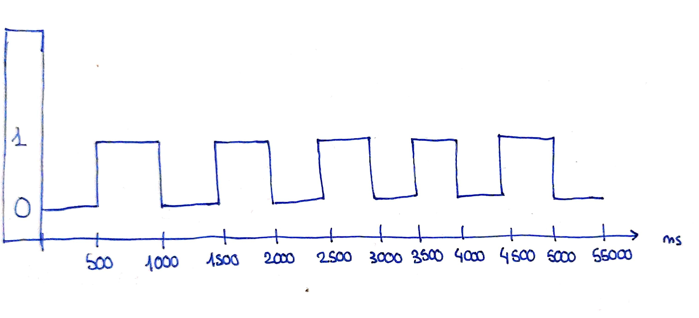
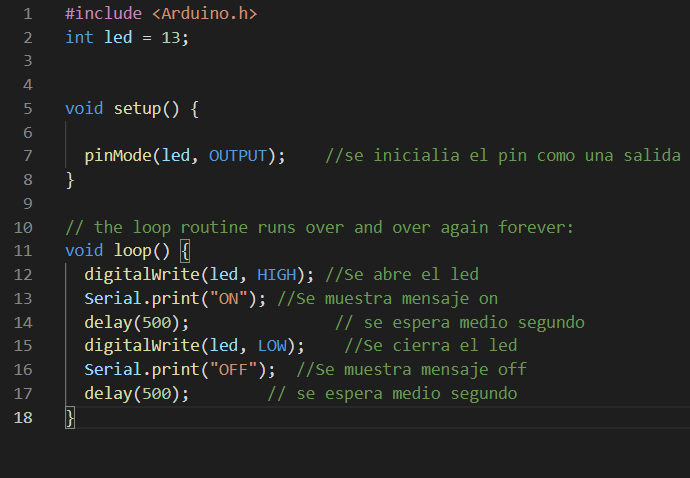

# Práctica 1 : Blink

## **Introducción** 
Mediante referencia Github que se da en el documento de prácticas se busca producir un parpadeo periódico mediante un led.
## **Tecnologías**
### Elementos necesarios para la práctica
- Esp32-Wroom-32D
- Led
### Software
- Visual studio
- PlatformIO
- Arduino
## **Setup y Funcionamiento**
En primer lugar, se inicia el entorno de trabajo, se escoge el dispositivo en nuestro caso esp32dev.

A continuación, se escoge el pin en el que se conectara el led: 

Según la imagen el pin 13 se puede utilizar tanto de entrada como de salida. El led actúa como salida con lo cual se puede utiliar el pin.

Por otro lado se define un loop en el cual se irá repitiendo el proceso de abrir y apagar el led en intervalos de 500ms y a la vez mostrando el mensaje que está abierto o apagado. 

Por último se montará el programa y se cargará a la esp32 mediante la extensión de PlatfromIO de visual studio code.
                                                  
## **Respuestas y conclusiones** 

Como se ve en el gráfico de tiempo se puede observar que cada 500ms el led cambia de estar encendido a apagado hasta que paramos el programa.

El procesador no para hasta que el programa se para de forma manual puesto a que el programa es un loop es decir una instrucción de iteración infinita.
## **Código**

## **Referencias**
<https://randomnerdtutorials.com/esp32-pinout-reference-gpios/>

<https://github.com/schacon/blink>
