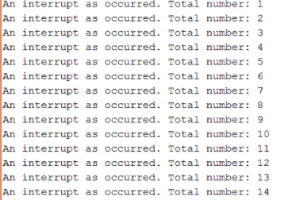

# Interacciones por timer
## **Introducción** 
Mediante un temporizador interno que al terminar un numero determinado un proceso se produzca una interrupción.
## **Material**
- esp32-Wroom-32D
- Software anteriormente mencionado 

## **Setup y funcionamiento**
Al igual que en la primera práctica se prepara el entorno de trabajo con VS studio y la extensión de PlatformIO.

A continuación implementamos el código dado en el enunciado de la práctica.
```ruby
volatile int interruptCounter;
int totalInterruptCounter;

hw_timer_t * timer = NULL;
portMUX_TYPE timerMux = portMUX_INITIALIZER_UNLOCKED;
```
Con el uso de *volatile* se tratará de evitar que elimine el contenido de la variable contador de interrupciones causado por el compilador.

Se define otra variable contador que contará el total de interrupciones la cual no requiere el uso de *volatile*.

Se definirá un puntero que servirá para configurar el tiempo. Y la última variable servirá para sincronizar el main loop y la ISR.
```ruby
void IRAM_ATTR onTimer() {
  portENTER_CRITICAL_ISR(&timerMux);
  interruptCounter++;
  portEXIT_CRITICAL_ISR(&timerMux);
}
```

Esta funcion servirá para contar el número de interrupciones, se producirá cada vez que el loop principal tenga una interrupción, todo esto ocurrirá dentro de una sección critica definida con los dos parametros ***portEXIT_CRITICAL_ISR(&timerMux);*** y ***portENTER_CRITICAL_ISR(&timerMux);***
```ruby
void setup() {
  Serial.begin(115200);
  timer = timerBegin(0, 80, true);
  timerAttachInterrupt(timer, &onTimer, true);
  timerAlarmWrite(timer, 1000000, true);
  timerAlarmEnable(timer);
}
```
Teniendo en cuenta que la esp32 la frecuencia base de señal usada es 80 MHz se define en el *timerAlarmWrite* que estamos trabajando en microsegundos de ahí el 1000000. El valor true del *timer* indica que el contador contará de forma progresiva.

Con la funcion *timerAttachInterrupt* servirá para utilizar la interrupción. El parámetro será la variable de tiempo global, *&onTimer* se trata de una ubicación de la función anteriormente mencionada, el parámetro *true* indica que la interrupción será de tipo edge. 

*timerAlarmWrite* servirá para especificar el valor del contador en el que se generará la interrupción del temporizador. El parámetro true indicará que el contador se recargará por lo tanto la interrupción se generará de forma periódica.

Por último, *timerAlarmEnable* que servirá para habilitar el temporizador.

```ruby
void loop() {
  if (interruptCounter > 0) {
    portENTER_CRITICAL(&timerMux);
    interruptCounter--;
    portEXIT_CRITICAL(&timerMux);
    totalInterruptCounter++;
    Serial.print("An interrupt as occurred. Total number: ");
    Serial.println(totalInterruptCounter);
  }
  ```
  En el loop principal se definirá que si el contador de interrupciones es superior a 0 se imprima en el puerto serie que el proceso se ha interrumpido y el número total de interrupciones.

## Resultado

 
## Codigo completo

```ruby
#include <Arduino.h>


volatile int interruptCounter;
int totalInterruptCounter;

hw_timer_t * timer = NULL;
portMUX_TYPE timerMux = portMUX_INITIALIZER_UNLOCKED;

void IRAM_ATTR onTimer() {
  portENTER_CRITICAL_ISR(&timerMux);
  interruptCounter++;
  portEXIT_CRITICAL_ISR(&timerMux);
}

void setup() {
  Serial.begin(115200);
  timer = timerBegin(0, 80, true);
  timerAttachInterrupt(timer, &onTimer, true);
  timerAlarmWrite(timer, 1000000, true);
  timerAlarmEnable(timer);
}

void loop() {
  if (interruptCounter > 0) {
    portENTER_CRITICAL(&timerMux);
    interruptCounter--;
    portEXIT_CRITICAL(&timerMux);
    totalInterruptCounter++;
    Serial.print("An interrupt as occurred. Total number: ");
    Serial.println(totalInterruptCounter);
  }
}
```
##Referencias
[https://techtutorialsx.com/2017/10/07/esp32-arduino-timer-interrupts/](https://techtutorialsx.com/2017/10/07/esp32-arduino-timer-interrupts/)
